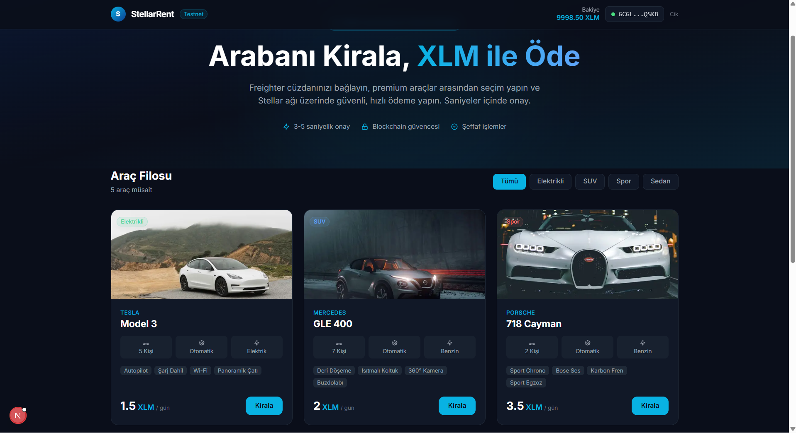
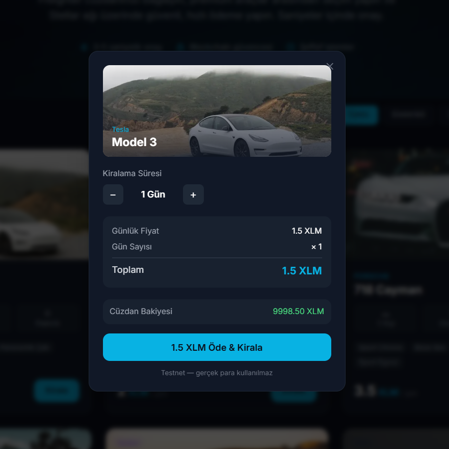
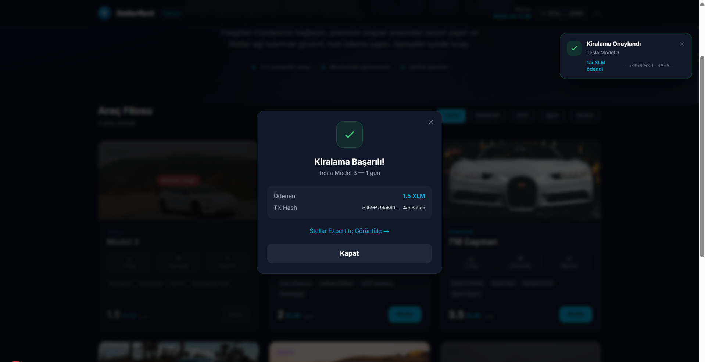

# StellarRent — Blockchain Car Rental dApp

A decentralized daily car rental application built on the **Stellar Network**, featuring **Freighter wallet** authentication and on-chain XLM payments.

---

## Live Demo

> Run locally with `npm run dev` → [http://localhost:3000](http://localhost:3000)

---

## Screenshots

### Home Page — Car Fleet


### Rental Modal — Payment Confirmation


### Success Toast Notification


---

## Transaction Hash

Test transaction successfully submitted on **Stellar Testnet**:

```
e3b6f53da6897afe1b3bec97b043ccb5303fddcd6ab9a918e41a5a824ed8a5ab
```

> [View on Stellar Expert](https://stellar.expert/explorer/testnet/tx/e3b6f53da6897afe1b3bec97b043ccb5303fddcd6ab9a918e41a5a824ed8a5ab)

---

## Features

- **Freighter Wallet Login** — Connect your Stellar wallet in one click
- **Real XLM Payments** — On-chain payments via Stellar Testnet
- **Smart Destination Handling** — Automatically uses `createAccount` if the rental company account doesn't exist yet
- **Live Balance Display** — Your XLM balance updates after every transaction
- **Multi-day Rental** — Choose 1–30 days; total price calculated in real time
- **Category Filtering** — Filter cars by Electric, SUV, Sport, Sedan
- **Transaction Toast** — Success notification in the top-right corner with Stellar Expert link
- **Detailed Error Messages** — Extracts Horizon `result_codes` for meaningful feedback

---

## Tech Stack

| Layer | Technology |
|---|---|
| Framework | Next.js 16 (App Router) |
| Language | TypeScript |
| Styling | Tailwind CSS |
| Blockchain | Stellar Testnet |
| Wallet | Freighter (`@stellar/freighter-api` v3) |
| Stellar SDK | `@stellar/stellar-sdk` v13 |
| API | Horizon REST (`horizon-testnet.stellar.org`) |

---

## Project Structure

```
stellar-projem/
├── app/
│   ├── layout.tsx          # Root layout
│   ├── page.tsx            # Main page with toast logic
│   └── globals.css
├── components/
│   ├── Header.tsx          # Navbar with wallet connect button
│   ├── Hero.tsx            # Landing hero section
│   ├── CarCard.tsx         # Individual car listing card
│   ├── RentModal.tsx       # Rental flow modal (confirm → sign → submit)
│   └── Toast.tsx           # Success notification
├── hooks/
│   └── useFreighter.ts     # Freighter wallet hook
├── lib/
│   ├── stellar.ts          # Horizon client & balance helper
│   └── transactions.ts     # Transaction builder & submitter
└── data/
    └── cars.ts             # Car fleet data & rental wallet address
```

---

## How It Works

```
User clicks "Kirala"
       ↓
RentModal opens → user selects rental days
       ↓
buildRentalPaymentTx()
  · Checks if rental wallet exists on testnet
  · Uses payment op  (account exists)
  · Uses createAccount op  (account doesn't exist)
       ↓
Freighter popup → user signs the XDR
       ↓
Raw XDR POST to horizon-testnet.stellar.org/transactions
       ↓
Success → toast notification with TX hash + Stellar Expert link
```

---

## Getting Started

### Prerequisites

- Node.js 20+
- [Freighter browser extension](https://freighter.app)
- Freighter configured to **Testnet**
- Testnet XLM (get free XLM from [Stellar Friendbot](https://friendbot.stellar.org))

### Installation

```bash
# Clone the repository
git clone https://github.com/YOUR_USERNAME/stellar-projem.git
cd stellar-projem

# Install dependencies
npm install

# Start development server
npm run dev
```

Open [http://localhost:3000](http://localhost:3000) in your browser.

### Fund Your Testnet Wallet

1. Open Freighter → switch network to **Testnet**
2. Copy your public key (starts with `G`)
3. Visit [https://friendbot.stellar.org/?addr=YOUR_ADDRESS](https://friendbot.stellar.org)
4. You'll receive **10,000 XLM** for testing

---

## Car Fleet & Pricing (Testnet)

| Car | Category | Daily Price |
|-----|----------|-------------|
| Tesla Model 3 | Electric | 1.5 XLM |
| Mercedes GLE 400 | SUV | 2.0 XLM |
| Porsche 718 Cayman | Sport | 3.5 XLM |
| BMW X5 M | SUV | 2.8 XLM |
| Alfa Romeo Giulia | Sedan | 1.8 XLM |
| Land Rover Range Rover Sport | SUV | 3.2 XLM |

> All prices are in testnet XLM. No real money is involved.

---

## Network Configuration

| Setting | Value |
|---------|-------|
| Network | Stellar Testnet |
| Horizon URL | `https://horizon-testnet.stellar.org` |
| Network Passphrase | `Test SDF Network ; September 2015` |
| Explorer | [stellar.expert/testnet](https://stellar.expert/explorer/testnet) |

---

## Built With

- [Stellar Developer Docs](https://developers.stellar.org)
- [Freighter API](https://docs.freighter.app)
- [Next.js](https://nextjs.org)
- [Tailwind CSS](https://tailwindcss.com)

---

## License

MIT
